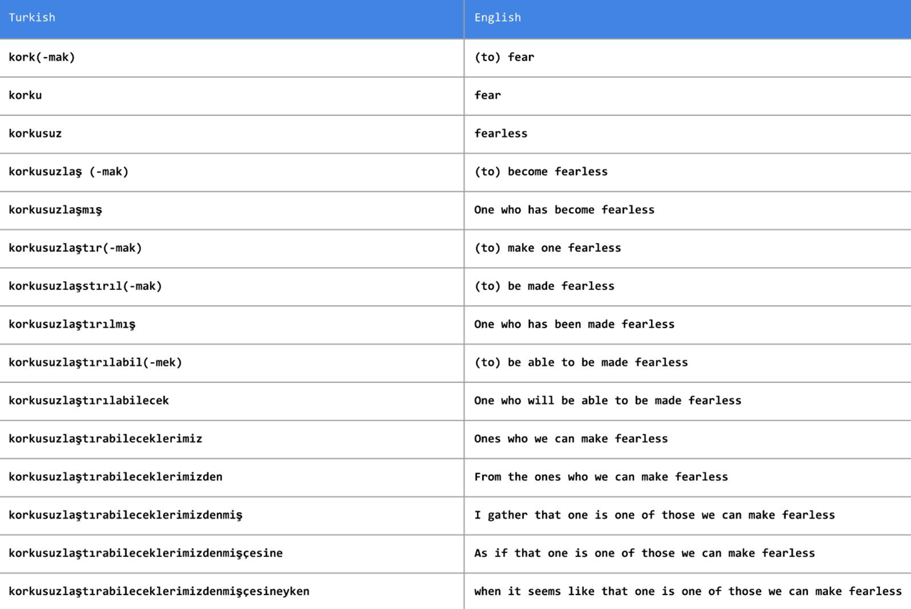
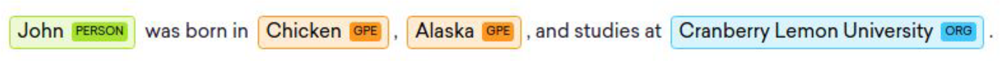
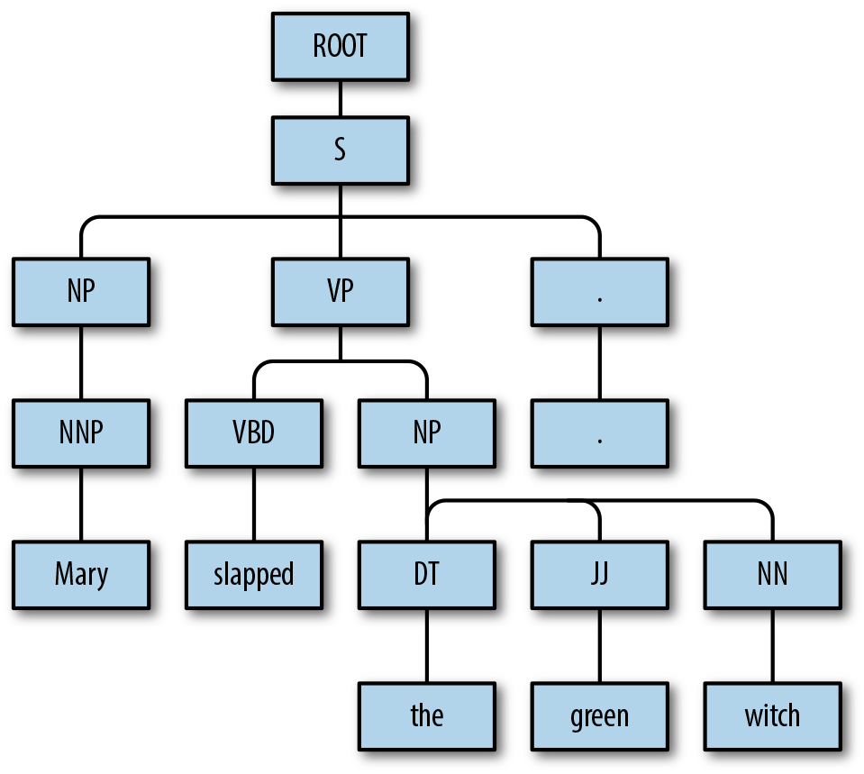
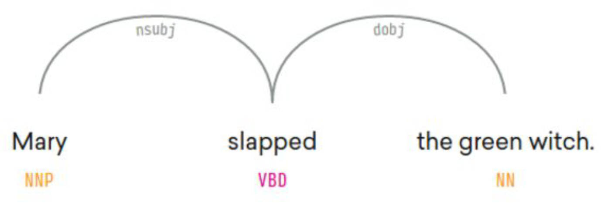
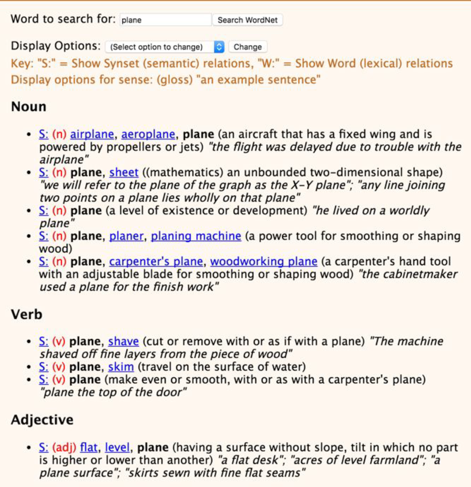

# 第2章 传统NLP快速一览
“自然语言处理（NLP，前一章介绍）和计算语言学（CL）是人类语言计算研究的两个领域。 NLP旨在开发解决涉及语言的实际问题的方法，例如信息提取，自动语音识别，机器翻译，情感分析，问答和总结。 另一方面，CL使用计算方法来理解人类语言的属性。 我们如何理解语言？ 我们如何制作语言？ 我们如何学习语言？ 语言之间有什么关系？“

在文献中，通常会看到方法和研究人员的交叉，从CL到NLP，反之亦然。 CL中关于语言的经验教训可用于通知NLP的先验，NLP的统计和机器学习方法可用于回答CL寻求回答的问题。 实际上，其中一些问题已经膨胀成了自己的学科，如音韵学，形态学，语法学，语义学和语用学。

在本书中，我们只关注NLP，但我们会根据需要从CL中经常借用想法。 在我们完全投入NLP的神经网络方法之前 - 本书其余部分的重点 - 值得回顾一些传统的NLP概念和方法。 这是本章的目标。
如果你有一些NLP的背景知识，你可以跳过这一章，但你也可以留意怀旧并建立一个未来的共享词汇

## Corpora, Tokens, and Types（语料，标记，类型）

所有NLP方法，无论是经典的还是现代的，都以文本数据集开始，也称为语料库（复数：语料库）。语料库通常包含原始文本（ASCII或UTF8）以及与文本关联的任何元数据。原始文本是一系列字符（字节），但大多数情况下将这些字符分组为称为标记的连续单元很有用。在英语中，标记对应于由空格字符或标点符号分隔的单词和数字序列。

元数据可以是与文本相关的任何辅助信息，例如标识符，标签和时间戳。 在机器学习的说法中，文本及其元数据称为实例或数据点。 语料库（图2-1）是一组实例，也称为数据集。 鉴于本书重点关注机器学习，我们可以自由地交换术语语料库和数据集。


图21 语料库：NLP任务的起点。

将文本分解为标记的过程称为标记化。 例如，世界语句子“Maria frapis la verdasorĉistino”中有六个标记.1标记化可能比简单地基于非字母数字字符拆分文本更复杂，如图2-2所示。 对于像土耳其语这样的凝聚性语言，分裂空格和标点可能是不够的，可能需要更专业的技术。 正如您将在第4章和第6章中看到的那样，通过将文本表示为字节流，可以完全避免某些神经网络模型中的标记化问题; 这对于凝聚语言来说非常重要。

图22 土耳其语等语言的标记化会变得复杂。

最后，请考虑以下推文：

标记推文涉及保留主题标签和@handles，并将表情符号 例如:-)和URL分段为一个单元。 标签 #MakeAMovieCold应该是一个符记还是四个？ 大多数研究论文都没有对这些问题给予太多关注，事实上，许多标记化决策往往是随意的 - 但这些决策在实践中的准确性会比公认的更大。 通常被认为是预处理的繁重工作，大多数开源NLP包为标记化提供了合理的支持，以帮助您入门。 例2-1显示了来自NLTK和spaCy的示例，这两个常用的文本处理包。

例2-1 标记文本
- input 0
```python
import spacy
nlp = spacy.load('en')
text = "Mary, don’t slap the green witch"
print([str(token) for token >in nlp(text.lower())])
```
- output 0
```
“['mary', ',', 'do', "n't", 'slap', 'the', 'green', 'witch', '.']”
```
- input 1
```python
from nltk.tokenize import TweetTokenizer
tweet=u"Snow White and the Seven Degrees
    #MakeAMovieCold@midnight:-)"
tokenizer = TweetTokenizer()
print(tokenizer.tokenize(tweet.lower()))
```
- output 1
```
['snow', 'white', 'and', 'the', 'seven', 'degrees', 
 '#makeamoviecold', '@midnight', ':-)']
```

类型是语料库中存在的独特令牌。 语料库中所有类型的集合是其词汇或词汇。 单词可以被区分为内容单词和停用词。 诸如文章和介词之类的替代词主要用于语法目的，比如填充内容词。

<div style='margin:20px;background-color:#eee; text-align:center'>
<h3>特征工程</h3>
类型是语料库中存在的独特令牌。 语料库中所有类型的集合是其词汇或词汇。 单词可以被区分为内容单词和停用词。 诸如文章和介词之类的替代词主要用于语法目的，比如填充内容词。
</div>

# Unigrams, Bigrams, Trigrams, …, N-grams
N-gram是文本中出现的固定长度（n）连续令牌序列。 二元组有两个令牌，一个是单字符号。 从文本生成n-gram非常简单，如例2-2所示，但像spaCy和NLTK这样的包提供了方便的方法。

例2-2。 从文本生成n-gram
- input 0
```python
def n_grams(text, n):
    '''
    takes tokens or text, returns a list of n-grams
    '''
    return [text[i:i+n] for i in range(len(text)-n+1)]

cleaned = ['mary', ',', "n't", 'slap', 'green', 'witch', '.']
print(n_grams(cleaned, 3))
```
- output 0
```
[['mary', ',', "n't"],
 [',', "n't", 'slap'],
 ["n't", 'slap', 'green'],
 ['slap', 'green', 'witch'],
 ['green', 'witch', '.']]
```
# Lemmas and Stems
Lemmas是词语的根本形式。 考虑动词飞。 它可以变成许多不同的词 - 流动，飞行，苍蝇，飞行，流动等等 - 飞行是所有这些看似不同的词语的引理。 有时，将标记减少到它们的引理可能是有用的，以保持向量表示的维度较低。 这种缩减称为词形还原，您可以在示例2-3中看到它的实际效果。

例2-3 词形还原：将单词缩减为根形式
- input 0
```python
import spacy
nlp = spacy.load('en')
doc = nlp(u"he was running late")
for token in doc:
    print('{} --> {}'.format(token, token.lemma_))
```
- output 0
```
he --> he
was --> be
running --> run
late --> late
```
例如，spaCy使用一种名为WordNet的预定义字典来提取引理，但是词形还原可以被视为需要理解语言形态的机器学习问题。
干扰是穷人的词形还原。它涉及使用手工制作的规则来删除词语的结尾，以将它们缩减为称为词干的常见形式。 通常在开源软件包中实现的流行词干分析器包括Porter和Snowball词干分析器。 我们留给您找到合适的spaCy/NLTK API来执行词干。
# 对句子和文件进行分类
对文件进行分类或分类可能是NLP最早的应用之一。 我们在第1章中描述的TF和TF-IDF表示可以立即用于对较长的文本块（如文档或句子）进行分类和分类。 诸如分配主题标签，预测评论情绪，过滤垃圾邮件，语言识别和电子邮件分类等问题可以构成监督文档分类问题。 （半监督版本，其中只使用了一个小的标记数据集，非常有用，但该主题超出了本书的范围。）

我们可以将标签的概念从文档扩展到单个单词或标记。 分类单词的一个常见例子是词性（POS）标记，如例2-4所示。

- input 0
```python
import spacy
nlp = spacy.load('en')
doc = nlp(u"Mary slapped the green witch.")
for token in doc:
    print('{} - {}'.format(token, token.pos_))
```
- output 0
```
Mary - PROPN
slapped - VERB
the - DET
green - ADJ
witch - NOUN
. - PUNCT
```
# 分类跨度：分块和命名实体识别
通常，我们需要标记一段文字; 也就是说，一个连续的多重语音边界。 例如，考虑一句话，“玛丽打了一个绿色女巫。”我们可能想要识别其中的名词短语（NP）和动词短语（VP），如下所示：
其中的名词短语（NP）和动词短语（VP），如下所示：

`[NP玛丽] [VP打了] [绿色女巫]。`

这称为分块或浅解析。 浅解析旨在导出由语法原子组成的高阶单元，如名词，动词，形容词等。 如果您没有数据来训练浅层解析模型，则可以在词性标记上编写正则表达式来近似浅层解析。 幸运的是，对于英语和最广泛使用的语言，存在这样的数据和预训练模型。 例2-5给出了使用spaCy进行浅层解析的示例

例2-5 名词短语（NP）分块
- input 0
```python
import spacy
nlp = spacy.load('en')
doc  = nlp(u"Mary slapped the green witch.")
for chunk in doc.noun_chunks:
    print ('{} - {}'.format(chunk, chunk.label_))
```
- output 0
```
Mary - NP
the green witch - NP
```
另一种有用的跨度是命名实体。 命名实体是字符串提及现实世界的概念，如人，位置，组织，药物名称等。 这是一个例子：

# 句子结构

浅层解析识别短语单元，识别它们之间关系的任务称为解析。 您可能会从小学英语课程图表中回忆起如图2-3所示的例子。

图2-3。 “玛丽打了一个绿色女巫”句子的成分解析。

解析树表示句子中不同语法单位的层次关系。 图2-3中的解析树显示了所谓的组成解析。 显示关系的另一种可能更有用的方法是使用依赖解析，如图2-4所示。


图2-4。 句子的依赖性解析“玛丽打了一个绿色女巫

要了解有关传统解析的更多信息，请参阅本章末尾的”参考资料“部分。

# 词义和语义

言语具有意义，通常不止一个。 一个词的不同含义称为它的感官。 WordNet是普林斯顿大学长期运行的词汇资源项目，旨在对英语中所有（大多数）单词的感官以及其他词汇关系进行编目。
例如，考虑像”平面“这样的词。图2-5显示了可以使用这个词的不同意义。

图2-5。 感觉“飞机”这个词（由WordNet提供）

即使在现代方法的存在下，已经投入到像WordNet这样的项目中的几十年努力值得利用。 本书后面的章节介绍了在神经网络和深度学习方法的背景下使用现有语言资源的例子。
词义也可以从语境中诱导 - 从文本中自动发现词义是实际上第一个半监督学习应用于NLP。 尽管我们在本书中没有涉及，但我们鼓励您阅读Jurafsky和Martin（2014），第17章，以及Manning和Schütze（1999），第7章。


# 小结
在本章中，我们回顾了NLP中的一些基本术语和想法，这些术语和想法在未来的章节中应该很方便。 本章仅涉及传统NLP所提供的一些内容。 我们省略了传统NLP的重要方面，因为我们希望将本书的大部分内容分配给NLP的深度学习。 然而，重要的是要知道有大量的NLP研究工作不使用神经网络，但是具有很强的影响力（即广泛用于建筑生产系统）。 在许多情况下，应该考虑基于神经网络的方法作为补充而不是传统方法的替代。 经验丰富的从业者通常会利用两全其美的优势来构建最先进的系统。 要了解有关NLP传统方法的更多信息，我们建议您参考以下部分中列出的参考资料。

# 参考
1. Manning, Christopher D., and Hinrich Schütze. (1999). Foundations of Statistical Natural Language Processing. MIT press.
2. Bird, Steven, Ewan Klein, and Edward Loper. (2009). Natural Language Processing with Python: Analyzing Text with the Natural Language Toolkit. O’Reilly.
3. Smith, Noah A. (2011). Linguistic Structure prediction. Morgan and Claypool.
4. Jurafsky, Dan, and James H. Martin. (2014). Speech and Language Processing, Vol. 3. Pearson.
5. Russell, Stuart J., and Peter Norvig. (2016). Artificial Intelligence: A Modern Approach. Pearson.
6. Zheng, Alice, and Casari, Amanda. (2018). Feature Engineering for Machine Learning: Principles and Techniques for Data Scientists. O’Reilly.
<hr>

1. 翻译：”玛丽拍了绿色女巫。“我们在本章中以这句话为例。 我们承认这个例子相当暴力，但我们的使用是我们这个时代最着名的人工智能教科书（Russell和Norvig，2016）的帽子，它也使用这句话作为一个运行的例子。
2. 在第4章和第6章中，我们研究深度学习模型，它们有效地隐含地捕获了这个子结构。
3. 要理解词干和词形还原之间的区别，可以考虑“鹅”这个词。“词法化”产生“鹅”，而词干则产生“gees”。
4. 存在创建WordNet多语言版本的尝试。 以BabelNet为例
